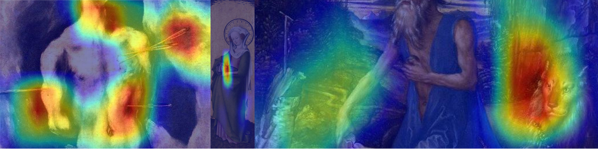

# An Explainable Deep Learning Baseline for Iconography Research in Artworks
## Author: Christopher Buch Madsen

This repository contains the codebase for the thesis "An Explainable Deep Learning Baseline for Iconography Research in Artworks" written by Christopher Buch Madsen while attending the Bachelor of AI at the University of Amsterdam. The thesis was delivered 29 January, 2021.



### Overview of how to run the code.

#### Requirements
    Python >= 3.9
    PyTorch >= 1.7.1+cu110
    Numpy
    Pandas
    Matplotlib
    Sklearn (>= 0.24.1)
    ipynb (for examples)
    
#### Setup
1. Clone this repository.
2. Download the ArtDL data set at: <br/>
http://www.artdl.org/ <br/>
Unzip the files and place the "DEVKitArt" folder in the folder prior to this repository.
3. Create a folder named "DataFolders" at the same destination as DEVKitArt <br/>
The directory tree should at this point look like: <br/>
```
| 
|───DEVKitArt
| 
|───DataFolders 
| 
|───main    <--- the project repository 
| 
...
```
4. Run the following python files from main/preprocessing consecutively:
    - seclude_img.py
    - make_class_folders.py
    - sort_data_by_folders.py
    - sort_data_by_folder_no_dup.py <br/>
This will set up the data in sorted folders, necessary for the project. <br/>
The updated directory tree: <br/>
```
| 
|───DEVKitArt 
| 
|───DataFolders 
|   |───data_by_class 
|   |───data_by_class_no_dup 
|   |───test_folder 
|   |   | 
|   |   |───test 
|   |   
|   |───train_folder 
|   |   | 
|   |   |───train 
|   |    
|   |───val_folder 
|   |   | 
|   |   |───val 
| 
|───main    <--- the project repository 
| 
...
```
#### Execution
##### Class activation mappings
To extract the class activation mappings (CAMs) for the test set with the VGG-16 models, run the following python script and answer the prompt: <br/>

    python vgg_cam.py
    
To extract the CAMs from the ArtDL model, the following python script can be run: <br/>

    python artdl_cam.py
    

##### Classifications
To classify the images in the test set with the VGG-16 models, run the following script and answer the prompt:

    python vgg_classify.py

To classify with the ArtDL model use:

    python artdl_classify.py

Running these scripts will save the predictions in the ```best_vgg_(model_number)_strategy``` folders for the VGG-16 model and ```evaluation_files``` folder for the ArtDL model.

##### Evaluation Metrics
To show the evaluation metrics for a model, run the following script and answer the prompt:

    python eval.py
    
This will generate the confusion matrices used for precision, recall and f1-score from the thesis.

##### Example Notebooks
A simple example notebook for making a classification of a single image and extracting the CAM has been provided in the jupyter notebook vgg_cam_example.ipynb, for a better overview. (Install jupyter notebook with pip install notebook, open it through the command line with "jupyter notebook" and navigate to the .ipynb provided)

##### Training the Models (Not Necessary)
If one desires to train the VGG-16 model using one of the strategies from the thesis, it is possible through the use of the following python scripts:

    python train_vgg.py
    
This will run the training for the amount of epochs stated in the file. Training the models with 200 epochs will take approximately 14 hours for strategy 2, and approximately 84 hours for strategy 1 and 3.

After the model(s) is done training, it will save the weights and training metrics in the ```best_vgg_(model number)_strategy``` folder.

##### General Overview of the Repository
**Folders** <br/>
```architecture``` is the location of the model architecture files. <br/>
```best_vgg_(model number)__strategy``` contain the final models (weights) from the experiments of the thesis. It also contains the training metrics as well as classifications made with vgg_classify.py <br/>
```evaluation_files``` is the destination for the CAMs extracted with vgg_cam.py and artdl_cam.py, it also contains the classifications made by the ArtDL model, and .csv files for the final predictions used for the CAMs. <br/>
```artdl_model``` contains the weights for the ResNet50 model provided by the ArtDL project. <br/>
```preprocessing``` contains files used for data preprocessing and creating of data folders. <br/>
```sets``` contains text files for the training/validation/test sets and the lists of classes. <br/>
```test-data``` contains images to be used in the example notebook <br/>
```torch_mods``` contains files which modfiy Torch classes. <br/>

**Files**
For ```artdl_cam.py, artdl_classify.py, train_vgg.py, vgg_cam.py, vgg_classify.py, eval.py``` see the descriptions above. <br/>
```data_prep_example.ipynb``` is a notebook used for producing the preprocessing example shown in the thesis <br/>
```training_graphs.ipynb``` is a notebook used for producing the training metrics graphs shown in the thesis. <br/>

All rights of the ArtDL project and model go to Milani et al., their repository can be found at: https://github.com/iFede94/ArtDL <br/>
See the ArtDL_README.md
